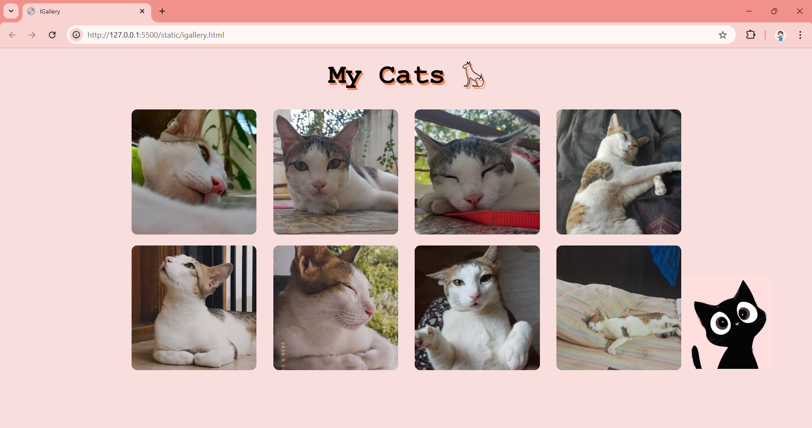
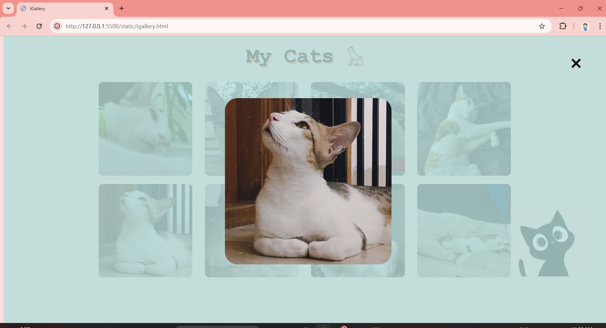

# Ex.08 Design of Interactive Image Gallery
## Date: 23-122024

## AIM:
To design a web application for an inteactive image gallery with minimum five images.

## DESIGN STEPS:

### Step 1:
Clone the github repository and create Django admin interface.

### Step 2:
Change settings.py file to allow request from all hosts.

### Step 3:
Use CSS for positioning and styling.

### Step 4:
Write JavaScript program for implementing interactivity.

### Step 5:
Validate the HTML and CSS code.

### Step 6:
Publish the website in the given URL.

## PROGRAM :
```
<html>

<head>
    <title>IGallery</title>
    <style>
        #dis {
            width: 100%;
            height: 100%;
            background: rgba(182, 220, 218, 0.805);
            position: fixed;
            top: 0;
            bottom: 0;
            display: none;
            align-items: center;
            justify-content: center;
            z-index: 100;
        }

        #dis img {
            border-radius: 30px;
            width: 400px;
            height: 400px;
        }

        div img {
            width: 225px;
            height: 225px;
            cursor: pointer;
            border-radius: 10px;
        }

        .img {
            overflow: hidden;
        }

        .col1 {
            display: flex;
            gap: 30px;
            margin-top: 20px;
            justify-content: center;
        }

        .col2 {
            display: flex;
            gap: 30px;
            margin-top: 20px;
            justify-content: center;
        }

        close {
            color: rgb(16, 16, 16);
            font-weight: 700;
            position: absolute;
            top: 5%;
            right: 5%;
            font-size: 50px;
            cursor: pointer;
        }

        body {
            background-image: url(bg.jpg);
            background-repeat: no-repeat;
            background-color: rgb(249, 222, 222);
            background-size: 300px;
            background-position: 1090px 410px;
            height: fit-content;
        }

        div {
            transition: transform 0.3s ease, box-shadow 0.3s ease;
        }
        div .img:hover {
            transform: scale(1.1);
            box-shadow: 0 8px 15px rgba(0, 0, 0, 0.2);
        }

        h1 {
            text-align: center;
            font-size: 50px;
            font-family: 'Courier New', Courier, monospace;
            font-weight: 600;
            text-shadow: 3px 4px rgb(243, 134, 87);
        }
    </style>

</head>

<body>
    <header>
        <h1>My Cats 𓃠</h1>
    </header>
    <section id="dis">
        
        <close class="cls" onclick="closes()">&times;</close>

    </section>
    <div class="col1">
        <div class="img">
            
        </div>
        <div class="img">
            
        </div>
        <div class="img">
            
        </div>
        <div class="img">
            
        </div>
    </div>
    <div class="col2">
        <div class="img">
            
        </div>
        <div class="img">
            
        </div>
        <div class="img">
            
        </div>
        <div class="img">
            
        </div>

    </div>


    <script>
        var dis = document.getElementById("dis");
        var disimg = document.getElementById("disimg");
        function opens(image) {
            dis.style.display = "flex";
            disimg.src = image;
        }
        function closes() {
            dis.style.display = "none";

        }
    </script>
</body>

</html>
```
## OUTPUT:





## RESULT:
The program for designing an interactive image gallery using HTML, CSS and JavaScript is executed successfully.
